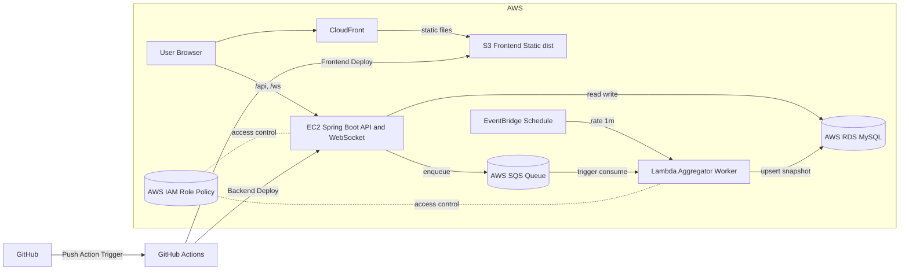

# Festival Flow 포트폴리오 정리

## 1. 프로젝트 개요

### 프로젝트명
Festival Flow (축제 웨이팅·테이블 운영 지원 서비스)

### 문제 정의 및 목표
축제 기간 주점/부스 운영에서는 대기 등록, 호출, 입장 확인, 테이블 배정을 짧은 시간 안에 정확히 처리해야 합니다.
수기 운영에서는 누락/지연이 발생하기 쉬워, 학생과 관리자 모두 실시간 현황 확인이 어려웠습니다.

이를 해결하기 위해 학생용 모바일 화면과 관리자 대시보드를 통합하고,
웨이팅 등록부터 호출·입장·테이블 배정까지 한 흐름으로 처리하는 운영형 서비스를 구현했습니다.
또한 QR/TOTP 검증과 실시간 알림을 적용해 현장 운영 정확도와 처리 속도를 높였습니다.

### 핵심 범위(아키텍처/구현)
- 서비스: 학생/관리자 웹, 웨이팅 API, 테이블 API, 채팅 API, QR 검증 API, WebSocket 알림
- 인프라: EC2(Spring Boot), S3 + CloudFront(프론트), RDS(MySQL), Redis, Lambda(EventBridge 주기 집계)
- 운영: 환경변수 기반 설정 외부화(12-factor), CloudFront SPA 라우팅, CORS 정책 관리, SG-to-SG 보안 적용

### 요구사항 요약
#### 기능 요구사항
- 학생: 이름/전화번호 기반 로그인 후 웨이팅 신청/조회/취소
- 관리자: 대기열 조회, 호출/입장 확인, 테이블 상태 변경 및 배정
- QR 입장권: 호출 상태에서만 유효한 QR(TOTP) 생성/검증
- 실시간성: WebSocket + Polling 혼합으로 순번/호출 상태 반영
- 대시보드: 총 대기, 사용 중 테이블, 호출 인원, 당일 처리량 제공

#### 비기능 요구사항
- 가용성: 실시간 API/WebSocket은 EC2 유지, 집계성 워크로드는 Lambda 분리
- 성능: CloudFront 정적 캐시 + Redis 캐시(TTL/Evict)로 응답속도 및 DB 부하 개선
- 보안: RDS 인바운드 3306을 EC2/Lambda SG 소스로만 허용, CORS origin 명시 관리
- 운영성: DB/Redis/CORS 설정 환경변수화, snapshot + fallback 구조로 기능 연속성 확보

## 2. 아키텍처 설계

아래는 동일 구성을 텍스트로 확인할 수 있는 mermaid 버전입니다.

## 3. 아키텍처 의사결정

### 1) CloudFront + S3 정적 배포 선택 이유
- React(Vite) 프론트를 서버리스 정적으로 운영해 인프라 복잡도와 운영비를 낮춤
- Edge 캐시를 통해 초기 로딩 성능을 안정적으로 확보
- SPA 라우팅 이슈는 `index.html` fallback(403/404 -> 200)으로 구조적으로 해결

### 2) RDS 분리(운영 DB 분리) 이유
- 애플리케이션 서버(EC2)와 DB 계층을 분리해 장애 영향 범위를 축소
- 서버/컨테이너 재배포와 무관하게 데이터 영속성 보장
- 로컬/운영은 동일 코드, 접속 정보만 환경별로 분리

### 3) SG-to-SG 보안 정책 이유
- DB 포트(3306)를 인터넷에 개방하지 않고 EC2/Lambda SG만 허용
- 최소 권한 네트워크 정책으로 공격 표면 축소
- 운영 중 보안 점검 시 허용 경로를 명확히 추적 가능

### 4) 설정 외부화(환경변수) 이유
- `DB_URL`, `DB_USERNAME`, `DB_PASSWORD`, `REDIS_*`, `APP_CORS_ALLOWED_ORIGINS`를 코드에서 분리
- 배포 환경 변경 시 코드 수정 없이 설정만 교체 가능
- 환경 차이로 인한 배포 실패 가능성 감소

### 5) 실시간 경로와 비동기 경로 분리
- 실시간 API/WebSocket은 EC2(Spring) 유지
- 집계성 작업은 Lambda + EventBridge로 분리
- 지연 민감 기능의 안정성을 유지하면서 주기 작업 비용 최적화

### 6) `/api/admin/dashboard/stats` 구조 전환
- 요청 시 실시간 계산 -> snapshot 우선 조회 구조로 전환
- snapshot 누락/지연 시 기존 실시간 계산 fallback 유지
- 기능 연속성을 보장하며 DB 읽기 부하 완화

## 4. 보안 및 배포·운영 자동화

### 1) 보안 조치: S3 퍼블릭 차단 + CloudFront OAC
- S3 퍼블릭 액세스 차단 유지
- CloudFront OAC를 통해서만 객체 접근 허용
- 정적 파일은 CDN 경유로만 노출

### 2) 보안 조치: RDS 접근 제어(SG 기반)
- RDS 인바운드 3306을 EC2/Lambda SG 소스로만 허용
- `0.0.0.0/0` 미사용 원칙 적용

### 3) 운영 안정화: CloudFront 반영 절차 + CORS 체크
- 배포 후 `Deployed` 상태 확인, 필요 시 invalidation 적용
- SPA fallback 설정(Default root object, 403/404 mapping) 유지
- CloudFront 도메인을 백엔드 CORS 허용 목록에 명시

### 4) IAM 권한 설계
- Lambda VPC 연결 시 ENI 권한 부족 이슈 확인
- `AWSLambdaVPCAccessExecutionRole` 반영으로 해결
- 기능 권한 + 네트워크 권한을 함께 점검하는 절차 정립

### 5) VPC/보안그룹 운영 절차
- Lambda를 RDS와 동일 VPC의 다중 AZ 서브넷에 연결
- Lambda SG -> RDS SG(3306)만 허용
- 함수 배포 전 IAM/VPC/SG 체크리스트화

## 5. 트러블슈팅 사례

### 5-1. 배포 이슈

#### RDS 전환 + 설정 외부화
- 문제: 배포 환경에서 DB 접속 실패(로컬 기준 설정 잔존)
- 조치: `application.properties`를 환경변수 기반으로 전환, EC2에 환경변수 주입 후 재기동
- 결과: 동일 코드로 로컬/운영 분리 배포 가능

#### RDS 보안그룹(SG-to-SG) 설정 미흡
- 문제: 백엔드에서 RDS 연결 타임아웃
- 조치: RDS SG 3306 인바운드를 EC2 SG 소스로 제한 허용
- 결과: DB 연결 복구 + 외부 직접 접근 차단 유지

#### CloudFront + S3 SPA 라우팅 오류(403/404)
- 문제: 새로고침/딥링크 시 403/404 발생
- 조치: Default root object와 403/404 -> `/index.html`(200) 설정
- 결과: 모든 SPA 라우트 정상 접근

#### Lambda VPC 연결 실패(CreateNetworkInterface)
- 문제: Lambda VPC 저장 실패
- 조치: 실행 역할에 `AWSLambdaVPCAccessExecutionRole` 추가
- 결과: Lambda VPC/서브넷/SG 연결 정상화

### 5-2. 운영 이슈

#### 대시보드 통계 API로 인한 DB 부하 증가
- 문제: `/api/admin/dashboard/stats` 폴링으로 RDS 읽기 부하 상승
- 조치: Redis 캐시 + Evict, Lambda 집계 + snapshot upsert, snapshot 우선 조회 + fallback 적용
- 결과: 응답 지연 감소, 읽기 부하 완화, 장애 시 기능 연속성 확보

#### CloudFront 경유 API/WS 경로 혼선
- 문제: 정적/동적 경로 정책 혼재로 API/WS 동작 불안정
- 조치: 경로 기반 동작 분리(`*`, `/api/*`, `/ws/*`) 및 캐시 정책 재정렬
- 결과: 정적 캐시 유지 + API/WS 안정화

#### 외부 데이터 의존 실패 시 기능 전파
- 문제: 외부 데이터 조회 실패가 핵심 기능 오류로 전파
- 조치: fallback 응답 경로 도입으로 기능 강건성 강화
- 결과: 외부 실패 상황에서도 핵심 기능 지속

#### CloudFront 캐시로 인한 구버전 노출
- 문제: 배포 직후 일부 사용자에게 이전 화면 노출
- 조치: invalidation 운영 절차 정립 + 캐시 정책 분리
- 결과: 배포 반영 시간 단축, 버전 불일치 감소

## 6. 비용 설계

### 1) 프리티어 제약 하 운영 원칙
- 고비용 관리형 구성을 무리하게 확대하지 않고, 운영 가능한 최소 구조 우선
- 실시간 경로는 EC2 유지, 비실시간 집계는 Lambda 분리

### 2) 비용 상한/절감 전략
- 불필요 리소스(EIP, 미사용 볼륨/로그) 정리 절차 유지
- 배포 파이프라인에 아티팩트/이미지 정리 루틴 포함
- 리소스 종료 시 연관 스토리지 및 네트워크 리소스 동시 점검

### 3) 컴퓨팅 비용 최적화
- 상시 처리(실시간 API/WebSocket): EC2
- 주기 처리(집계/후처리): Lambda + EventBridge
- 항상 켜둘 필요 없는 작업을 서버리스로 분리

### 4) 데이터/조회 비용 최적화
- CloudFront 정적 캐시로 원본 트래픽 감소
- Redis 캐시(`dashboardStats`, `tableList`, `waitingList`)로 DB 읽기 부담 완화
- TTL 분리 + 상태 변경 시 Evict로 성능/일관성 균형 유지
