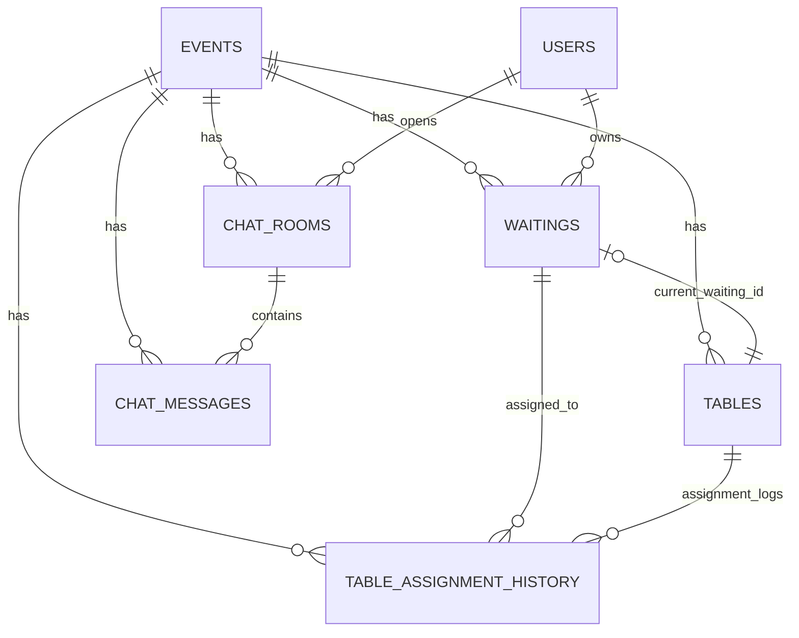

# DB Design (Final)

## 1. ERD

## 2. Data Dictionary

### 2.1 events
- `id` BIGINT PK, auto increment
- `name` VARCHAR(100), NOT NULL
- `start_date` DATE, NOT NULL
- `end_date` DATE, NOT NULL
- `status` VARCHAR(20), NOT NULL
- `created_at` DATETIME(6), NOT NULL
- `updated_at` DATETIME(6), NOT NULL

### 2.2 users
- `id` BIGINT PK, auto increment
- `kakao_id` VARCHAR, UNIQUE, NULL
- `name` VARCHAR, NOT NULL
- `nickname` VARCHAR, NULL
- `phone_number` VARCHAR, UNIQUE, NOT NULL
- `role` ENUM(`STUDENT`,`ADMIN`), NOT NULL
- `status` ENUM(`ACTIVE`,`BANNED`), NOT NULL
- `created_at` DATETIME(6), NOT NULL
- `updated_at` DATETIME(6), NOT NULL

### 2.3 waitings
- `id` BIGINT PK, auto increment
- `event_id` BIGINT FK -> events.id, NOT NULL
- `user_id` BIGINT FK -> users.id, NOT NULL
- `business_date` DATE, NOT NULL
- `head_count` INT, NOT NULL
- `status` ENUM(`WAITING`,`CALLED`,`ARRIVED`,`CANCELED`), NOT NULL
- `waiting_number` BIGINT, NOT NULL
- `call_time` DATETIME(6), NULL
- `totp_secret` VARCHAR(32), NULL
- `active_guard` TINYINT GENERATED (`WAITING`,`CALLED` => 1 else NULL)
- `created_at` DATETIME(6), NOT NULL
- `updated_at` DATETIME(6), NOT NULL

Key constraints:
- `UNIQUE(event_id, business_date, waiting_number)`
- `UNIQUE(user_id, active_guard)` (active waiting max 1)

### 2.4 tables
- `id` BIGINT PK, auto increment
- `event_id` BIGINT FK -> events.id, NOT NULL
- `table_number` INT, NOT NULL
- `capacity` INT, NOT NULL
- `status` ENUM(`EMPTY`,`OCCUPIED`,`CLEANING`), NOT NULL
- `current_waiting_id` BIGINT FK -> waitings.id, NULL
- `created_at` DATETIME(6), NOT NULL
- `updated_at` DATETIME(6), NOT NULL

Key constraints:
- `UNIQUE(event_id, table_number)`

### 2.5 chat_rooms
- `id` BIGINT PK, auto increment
- `event_id` BIGINT FK -> events.id, NOT NULL
- `user_id` BIGINT FK -> users.id, NOT NULL
- `status` ENUM(`OPEN`,`CLOSED`), NOT NULL
- `last_message` TEXT, NULL
- `created_at` DATETIME(6), NOT NULL
- `updated_at` DATETIME(6), NOT NULL

### 2.6 chat_messages
- `id` BIGINT PK, auto increment
- `event_id` BIGINT FK -> events.id, NOT NULL
- `chat_room_id` BIGINT FK -> chat_rooms.id, NOT NULL
- `sender_role` ENUM(`STUDENT`,`ADMIN`), NOT NULL
- `message` TEXT, NOT NULL
- `is_read` BOOLEAN, NOT NULL
- `type` ENUM(`TALK`,`SYSTEM`,`IMAGE` ...), NOT NULL
- `created_at` DATETIME(6), NOT NULL
- `updated_at` DATETIME(6), NOT NULL

### 2.7 table_assignment_history
- `id` BIGINT PK, auto increment
- `event_id` BIGINT FK -> events.id, NOT NULL
- `table_id` BIGINT FK -> tables.id, NOT NULL
- `waiting_id` BIGINT FK -> waitings.id, NOT NULL
- `started_at` DATETIME(6), NOT NULL
- `ended_at` DATETIME(6), NULL
- `active_guard` TINYINT GENERATED (`ended_at IS NULL` => 1 else NULL)
- `created_at` DATETIME(6), NOT NULL
- `updated_at` DATETIME(6), NOT NULL

Key constraints:
- `UNIQUE(table_id, active_guard)` (table active assignment max 1)
- `INDEX(event_id, table_id)`
- `INDEX(waiting_id)`

## 3. State Transition Table

### 3.1 waiting status
- Start: `WAITING`
- Allowed:
  - `WAITING -> CALLED`
  - `WAITING -> CANCELED`
  - `CALLED -> ARRIVED`
  - `CALLED -> CANCELED`
- Blocked:
  - `ARRIVED -> *`
  - `CANCELED -> *`

### 3.2 table status
- Start: `EMPTY`
- Allowed:
  - `EMPTY -> OCCUPIED`
  - `OCCUPIED -> CLEANING`
  - `CLEANING -> EMPTY`

Assignment history recording rule:
- `EMPTY -> OCCUPIED`: create one `table_assignment_history` row (`started_at=now`, `ended_at=NULL`)
- `OCCUPIED -> CLEANING`: close active row (`ended_at=now`)
- `CLEANING -> EMPTY`: no new row (only status normalization)
- Block assignment if same `table_id` already has active row (`ended_at IS NULL`)

### 3.3 chat_room status
- Start: `OPEN`
- Allowed:
  - `OPEN -> CLOSED`
  - `CLOSED -> OPEN` (new message or reopen)

## 4. Core Design Rules
- Root aggregate is `events`.
- Waiting number uniqueness scope is `(event_id, business_date)`.
- A user can have only one active waiting (`WAITING` or `CALLED`).
- A table can have only one active assignment history (`ended_at IS NULL`) at a time.
- Table/chat/message queries are scoped by `event_id`.

## 5. Assignment Lifecycle Rules
- Assignment start point: when waiting is assigned to table and table becomes `OCCUPIED`.
- Assignment end point: when table leaves `OCCUPIED` state (typically `OCCUPIED -> CLEANING`).
- Data consistency rule: `tables.current_waiting_id` and active history row must represent the same active occupancy.
- Audit rule: all completed occupancies must remain as immutable history rows (`started_at`, `ended_at` retained).
