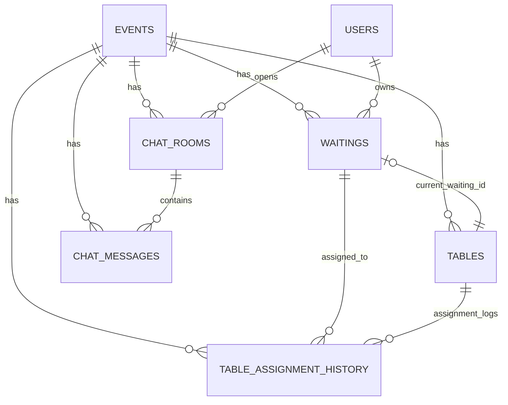

# DB Migration & Design One-Pager

## 1) 마이그레이션 확인 방법

### 1-1. 애플리케이션 로그에서 확인
- 백엔드 실행: `cd backend; .\\gradlew.bat bootRun`
- 아래 로그 패턴 확인
  - `Successfully applied ... migrations`
  - `Current version of schema ...: 4`

### 1-2. DB에서 Flyway 이력 직접 확인 (권장)
- 명령:
```bash
docker exec festival_flow_mysql mysql -uroot -proot1234 -D festival_flow -e "SELECT installed_rank, version, description, success FROM flyway_schema_history ORDER BY installed_rank;"
```
- 기대 결과:
  - version `1` `event and waiting constraints` success=1
  - version `2` `event scope tables and chat` success=1
  - version `3` `table assignment history` success=1
  - version `4` `table assignment history active guard` success=1

### 1-3. 핵심 테이블/제약 반영 확인
- 명령:
```bash
docker exec festival_flow_mysql mysql -uroot -proot1234 -D festival_flow -e "SHOW CREATE TABLE table_assignment_history\\G"
```
- 확인 포인트:
  - `active_guard` generated column 존재
  - `uq_tah_table_active (table_id, active_guard)` 존재

---

## 2) DB 제약 요약

### waitings
- `UNIQUE(event_id, business_date, waiting_number)`
  - 행사+영업일 단위 웨이팅 번호 중복 금지
- `UNIQUE(user_id, active_guard)`
  - 유저의 활성 웨이팅(`WAITING/CALLED`) 동시 1개만 허용

### users
- `UNIQUE(phone_number)`
  - 전화번호 중복 금지

### tables
- `UNIQUE(event_id, table_number)`
  - 행사 단위 테이블 번호 중복 금지

### table_assignment_history
- `UNIQUE(table_id, active_guard)`
  - 테이블 활성 배정 이력 동시 1개만 허용
- `FK(event_id -> events.id)`
- `FK(table_id -> tables.id)`
- `FK(waiting_id -> waitings.id)`

---

## 3) PR/발표용 1페이지 요약

### 3-1. 최종 ERD (핵심 관계)



### 3-2. 핵심 제약
- Aggregate Root: `events`
- 웨이팅 번호 유니크 범위: `(event_id, business_date)`
- 유저 활성 웨이팅: 최대 1개 (`WAITING`/`CALLED`)
- 테이블 활성 배정 이력: 최대 1개 (`ended_at IS NULL` 기준)
- 테이블/채팅/메시지 조회는 `event_id` 스코프 고정
- 스키마 변경 경로는 Flyway만 허용 (`ddl-auto=validate`)

### 3-3. 상태 전이 규칙

#### Waiting
- 허용: `WAITING -> CALLED -> ARRIVED`
- 허용: `WAITING -> CANCELED`, `CALLED -> CANCELED`
- 차단: `ARRIVED -> *`, `CANCELED -> *`

#### Table
- 허용: `EMPTY -> OCCUPIED -> CLEANING -> EMPTY`
- 정책: `OCCUPIED` 진입은 `assignTable` API만 허용

#### Assignment History 기록 시점
- 시작: `EMPTY -> OCCUPIED` (배정 시작 시 row 생성, `started_at=now`)
- 종료: `OCCUPIED -> CLEANING` (활성 row 종료, `ended_at=now`)
- 보장: 동일 `table_id`에 활성 row 중복 불가

### 3-4. 검증 완료 항목 (통합 테스트)
- `EMPTY -> OCCUPIED` 시 이력 1건 생성
- `OCCUPIED -> CLEANING` 시 `ended_at` 갱신
- 동일 테이블 활성 이력 중복 시 실패
- 유저 활성 웨이팅 중복 시 실패
- `(event_id, business_date, waiting_number)` 중복 시 실패

